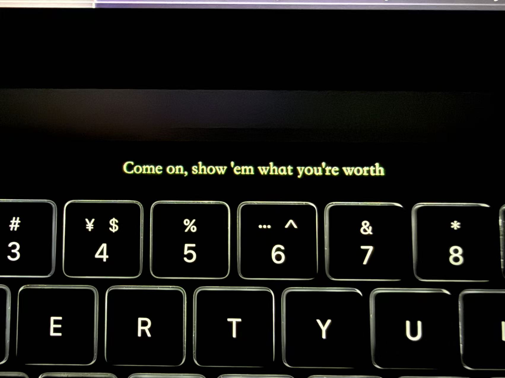

# 🎵 Spotify on Touchbar

> 在 MacBook Pro 的 Touch Bar 上实时显示 Spotify 正在播放歌曲的歌词。

[](https://www.apple.com/macos)
[](LICENSE)

## 🎬 效果展示



## ✨ 功能

- **Touch Bar 歌词显示** — 在 Touch Bar 上实时显示当前播放歌词，并带有当前行进度效果
- **Spotify 自动联动** — 随 Spotify 打开和关闭，后台持续保持同步
- **语言菜单** — 默认跟随系统语言，同时提供热门语言可选
- **LRC 时间同步** — 支持 LRC 格式的时间轴同步歌词
- **后台运行** — 菜单栏应用，不占 Dock 空间

## 📦 下载

**下载最新发布包后，直接运行 [Install.command](./Install.command)。**

> ⚠️ **注意：** 这个版本面向带 Touch Bar 的 MacBook Pro，并且是 Apple Silicon 版本。

## 🚀 安装

1. 下载发布包
2. 双击 `Install.command`
3. 按照安装成功提示完成安装
4. 如果没有自动打开，再从“应用程序”中启动 **Spotify on Touchbar**

安装器还会顺手装一个后台守护，让应用跟着 Spotify 的打开/关闭状态自动运行。

## ⚠️ 首次运行权限

首次运行时 macOS 会请求两个权限：

1. **辅助功能 (Accessibility)** — 需要授予以控制 Spotify
2. **AppleScript / 自动化** — 需要授予以读取 Spotify 播放信息

前往 **系统设置 → 隐私与安全性 → 辅助功能**，如果 macOS 提示，请添加 Spotify on Touchbar。

## 📖 使用方法

1. 确保 Spotify 正在播放
2. 点击菜单栏的 🎵 图标管理应用
3. 歌词会自动出现在 Touch Bar 上
4. 如有需要，可在菜单栏中切换语言

## 🔧 从源码构建

```bash
cd SpotifyOnTouchbar
./build.sh
open build/SpotifyLyrics
```

### 系统要求

- macOS 13.0 (Ventura) 或更高版本
- Xcode Command Line Tools
- Apple Silicon Mac（M1 / M2 / M3）
- Spotify 桌面客户端（非网页版）

## 🛠 技术细节

- **Spotify 通信**：通过 AppleScript 获取当前播放歌曲信息（曲名、歌手、进度）
- **歌词来源**：[LRCLib.net](https://lrclib.net) API（免费开源歌词数据库）
- **歌词格式**：LRC 时间轴同步歌词，支持 `[mm:ss.xx]` 格式
- **同步机制**：后台持续轮询 Spotify 播放进度，匹配歌词时间轴

## ⚠️ 已知限制

- Touch Bar 功能需要配备 Touch Bar 的 Mac（2016–2020 款 MacBook Pro）
- 歌词依赖 LRCLib.net 数据库，部分歌曲可能找不到歌词
- Spotify 必须为桌面客户端（非网页版）
- 支持 Apple Silicon（M1/M2/M3）Mac

## 📄 许可证

MIT License — 参见 [LICENSE](LICENSE)
